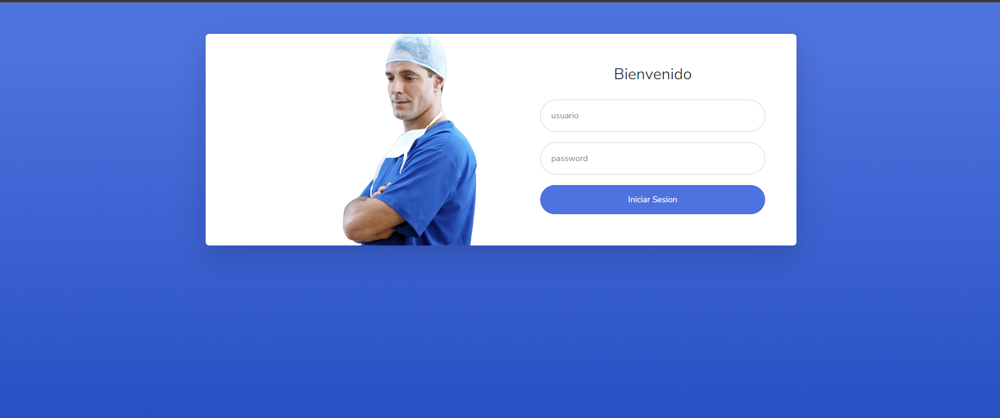
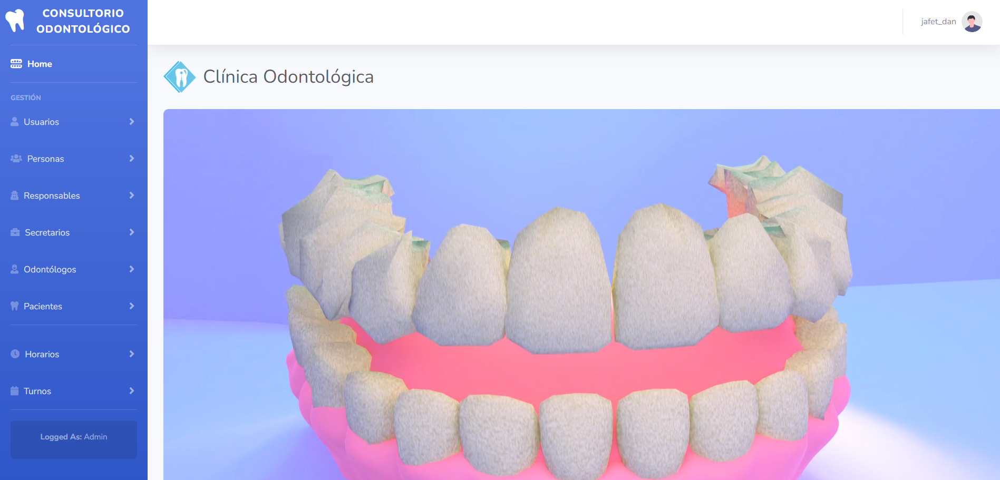
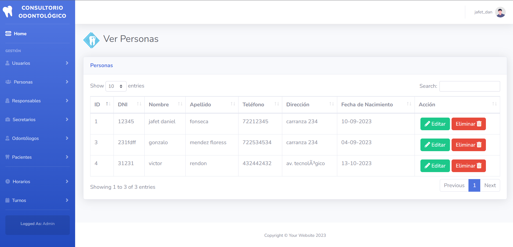

# Sistema para la gestión de un consultorio odontológico
sistema web realizado en Java utilizando tecnologías como JSP, Servlets, JPA, Servidor Tomcat
<ul>
  <li>Otras tecnologías utilizadas: HTML, CSS, JS, Bootstrap</li>
  <li>Base de datos MySQL</li>
</ul>

Descripción:

  Este proyecto tiene las funcionalidades de la gestión de pacientes y trabajadore del consultorio, agendar y administrar citas, horarios, ver turnos, ademas de contar con distintos roles de usuarios para el acceso.

